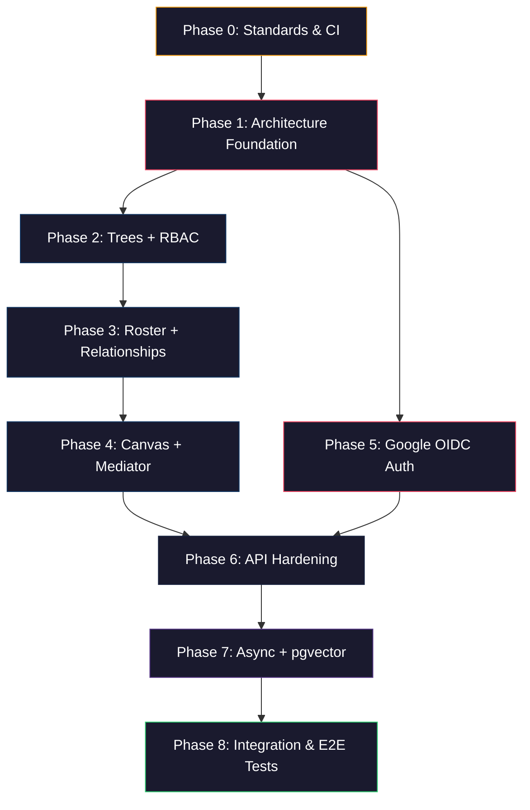

# FamilyTreeApp — .NET 10 Phased Implementation Plan (Revised)

> **Current state (last reviewed: Controllers pass):**
> Clean Architecture solution with four projects:
> - ✅ `FamilyTreeApp.Api` — ASP.NET Core 10 API, Google OAuth cookie auth, `GlobalExceptionHandler`, `TreesController`, `UsersController`, `AuthController`
> - ✅ `FamilyTreeApp.Domain` — `User`, `Tree`, `TreeRbac`, `ExternalLogin` entities; `ProfileInfo` value object; `Result<T>`, `Error`, `DomainErrors`; CQRS interfaces
> - ✅ `FamilyTreeApp.Application` — Users + Trees CQRS commands/queries; direct validation (inline guard clauses + domain factory validation); `IApplicationDbContext`; Scrutor DI registration
> - ✅ `FamilyTreeApp.Infrastructure` — `ApplicationDbContext`, `UnitOfWork`, EF Core model configurations, two applied migrations, `AuthService`
>
> See `requirements.md`, `design.md`, and `tasks.md` for the full specification.

## Resolved Decisions

> ✅ = confirmed and implemented | 🔄 = confirmed, revised from original plan | 🔴 = confirmed, not yet implemented

| Concern | Decision | Status |
|---|---|---|
| **Solution structure** | `FamilyTreeApp.Api`, `FamilyTreeApp.Domain`, `FamilyTreeApp.Application`, `FamilyTreeApp.Infrastructure` | ✅ |
| **Project naming** | `FamilyTreeApp.*` namespace throughout (not `Rooted.*`) | 🔄 |
| **Domain organization** | Feature-folders (`Domain/Users/`, `Trees/`, `Roster/`, `Canvas/`) | ✅ |
| **Phasing strategy** | Phase 0 (Standards + CI) → Phase 1 (Architecture-first) → Domain phases → Integration tests last | ✅ |
| **Authentication** | Google OAuth with ASP.NET Core cookie authentication. `AddGoogleOpenIdConnect` + cookie scheme. No custom JWT issued. | 🔄 |
| **Token flow** | Cookie-based session (`ExpireTimeSpan = 14 days`, `SlidingExpiration = true`). No JWT rotation. | 🔄 |
| **Identity linking** | `ExternalLogin` table `(UserId, Provider, SubjectId)` — provider-agnostic | ✅ |
| **User entity** | Plain domain entity (no `IdentityUser`). `IsPublic` (default `false`). Nullable `ProfileInfo` value object. | ✅ |
| **Profile data** | `ProfileInfo` record (nullable columns). Mapped via `OwnsOne()` (no `.ToJson()`). Field named `ProfileInfo`, not `PersonalInfo`. | 🔄 |
| **Google claim mapping** | Auto-populate `Email`, `FirstName`, `LastName`, `AvatarUrl` on first login. Rest starts `null`. | ✅ |
| **DbContext** | Plain `DbContext` (no `IdentityDbContext`). No Identity tables. | ✅ |
| **Public flag** | `IsPublic` on both `User` and `Tree` (default `false`) | ✅ |
| **RBAC enforcement** | Resource-based `IAuthorizationHandler` at the API boundary | 🔴 TASK-2.1 |
| **Read-Through** | Merge logic in `GetFamilyMembersQueryHandler` (inline DTO projection) | 🔴 TASK-3.7 |
| **Visibility** | State machine on `FamilyMember` entity. No separate `VisibilityMediator` service. | 🔴 TASK-3.1 |
| **Canvas model** | Three-layer: Biological (FamilyMember + Relationship) → Visual (TreeNode + TreeNodeMember + TreeEdge) | 🔴 Phase 4 |
| **Node types** | `Single`, `Partner`, `MultiPerson` — `TreeNodeMember` join table for many-to-many | 🔴 Phase 4 |
| **Relationship types** | Minimal: `Parent`, `Spouse`, `Sibling` (extensible later) | 🔴 TASK-3.3 |
| **Input validation** | Direct validation functions + domain factory validation. Inline guard clauses in handlers when needed. Domain entities enforce invariants via `Result<T>`. | 🔄 |
| **Error handling** | `Result<T>` for expected domain failures. Exceptions for unexpected infrastructure faults. | ✅ |
| **Async processing** | Deferred to Phase 7 (synchronous-first) | ✅ |
| **API hardening** | `GlobalExceptionHandler` + Problem Details in Phase 1 ✅; rate limiting + idempotency deferred to Phase 6 | 🔄 |
| **Testing** | Unit tests in Phases 0–7. Integration + E2E tests as Phase 8 (Testcontainers). | 🔴 TASK-0.4 |
| **pgvector** | `pgvector/pgvector:pg18` Docker image provisioned. Extension usage deferred to Phase 7. | 🔄 |
| **Result pattern** | Custom `Result<T>` in `FamilyTreeApp.Domain` (no external dependency) | ✅ |
| **Caching** | `IDistributedCache` abstraction; `MemoryDistributedCache` initially; Redis swap in Phase 6 | 🔴 TASK-2.2 |
| **CQRS dispatch** | `IRequest<T>`, `ICommandHandler<,>`, `IQueryHandler<,>` in Domain. Scrutor DI registration. Direct `[FromServices]` injection in controllers. Behavior pipeline via `Scrutor.Decorate<>()`. | ✅ |
| **Pipeline behaviors** | Named *behaviors* (not decorators). `LoggingBehavior` + `TransactionBehavior` 🔴 pending (TASK-1.2, TASK-1.3). Stacked via Scrutor LIFO. Execution order: Logging → Transaction → Handler (input validation happens in handler). | 🔄 |
| **Notifications** | `INotificationPublisher` + `INotificationHandler<T>` interfaces in Phase 1. Concrete publisher deferred to Phase 6. | 🔴 TASK-1.4, TASK-1.5 |
| **DI registration** | `DependencyInjection.cs` naming convention (not `ServiceScope.cs`) | 🔄 |
| **Docker** | `docker-compose.yml` exists with `pgvector/pgvector:pg18` + API. Redis (`redis:7-alpine`) to be added (TASK-0.2). | 🔄 |
| **CI/CD** | GitHub Actions: `dotnet format` → `dotnet build --warnaserror` → `dotnet test` | 🔴 TASK-0.3 |
| **Code style** | `.editorconfig` ✅ exists. `.globalconfig` (Roslyn analyzers) 🔴 pending (TASK-0.1). |  🔄 |

## Guiding Principles

1. **Standards-first** — code style, CI, and quality gates are established before any application code is written.
2. **Architecture-first** — the Clean Architecture skeleton, middleware pipeline, and cross-cutting infrastructure are fully wired before any domain feature is built.
3. **Incremental delivery** — each phase produces a working, testable slice of the system.
4. **Test gate** — every phase ends with a verification step (`dotnet build`, `dotnet test`, CI green). We do **not** move to the next phase until the gate passes.
5. **Dependency order** — domain phases follow the entity dependency graph: `Users` → `Trees` → `Roster` → `Canvas`.
6. **Backend-first** — the entire ASP.NET Core API is built and verified before touching Next.js.

## Error vs Exception Policy

> [!IMPORTANT]
> This policy is a non-negotiable architectural constraint. All code must adhere to it.

| Category | Mechanism | When to Use | Example |
|----------|-----------|-------------|---------|
| **Expected domain failure** | `Result<T>` / `Result` | Validation failures, entity not found, insufficient permissions, invalid state transitions. The caller can reasonably handle the failure. | `Result.Failure(DomainErrors.Tree.NotFound)` |
| **Unexpected infrastructure failure** | Exception | Database connection lost, Redis unavailable, external API timeout, null reference bugs. The system is in a bad state. | `DbUpdateException`, `HttpRequestException` |

**Layer rules:**
- **Domain layer:** Never throws for business rule violations. Always returns `Result<T>`.
- **Infrastructure layer:** May throw for unrecoverable failures (EF Core, network, etc.).
- **Application layer (handlers):** Returns `Result<T>`. Catches infrastructure exceptions only if it can provide a meaningful domain error.
- **API layer (controllers):** Maps `Result.Failure` → 4xx HTTP responses. Global exception handler catches unhandled exceptions → 500 with RFC 7807 Problem Details.

---

## Phase 0 — Standards & CI

> **Status:** 🔄 Partially complete. `.editorconfig` ✅ done. `.globalconfig`, CI workflow, and test project pending (TASK-0.1 through TASK-0.4).

**Goal:** Establish code style rules, Roslyn analyzers, and a GitHub Actions CI pipeline. Every push is automatically validated.

### 0.1 EditorConfig

#### ✅ `[DONE]` `.editorconfig` (solution root)
- Indentation: 4 spaces (C#), 2 spaces (JSON, YAML, XML).
- Charset: UTF-8.
- End of line: CRLF (Windows) / LF (CI).
- Trim trailing whitespace.
- Final newline: true.
- C# style rules:
  - `csharp_style_var_for_built_in_types = false` (explicit types for built-in).
  - `csharp_style_var_when_type_is_apparent = true`.
  - `csharp_style_namespace_declarations = file_scoped`.
  - `csharp_style_prefer_primary_constructors = true`.
  - `dotnet_sort_system_directives_first = true`.
  - `csharp_style_expression_bodied_methods = when_on_single_line`.
  - Nullable reference type warnings as errors.

### 0.2 Roslyn Analyzers

#### 🔴 `[TODO — TASK-0.1]` `.globalconfig` (solution root)
- Enable `dotnet_diagnostic` rules for:
  - CA1062 (validate arguments of public methods) — as warning.
  - CA1822 (mark members as static when applicable) — as suggestion.
  - CA2007 (do not directly await a Task) — as warning.
  - CA1848 (use LoggerMessage delegates) — as suggestion.
  - IDE0005 (remove unnecessary using) — as error.
  - Nullable reference type analysis — as error.

### 0.3 GitHub Actions CI

#### 🔴 `[TODO — TASK-0.3]` `.github/workflows/ci.yml`

```yaml
name: CI
on:
  push:
    branches: [main]
  pull_request:
    branches: [main]

jobs:
  build-and-test:
    runs-on: ubuntu-latest
    steps:
      - uses: actions/checkout@v4
      - uses: actions/setup-dotnet@v4
        with:
          dotnet-version: '10.0.x'
      - name: Restore
        run: dotnet restore
      - name: Format Check
        run: dotnet format --verify-no-changes --verbosity diagnostic
      - name: Build
        run: dotnet build --no-restore --warnaserror
      - name: Test
        run: dotnet test --no-build --verbosity normal
```

### 0.4 Test Gate

```bash
dotnet format --verify-no-changes    # Passes (no code to format yet, but pipeline is validated)
dotnet build --warnaserror           # Solution compiles
```

- CI workflow runs successfully on push.
- `.editorconfig` is recognized by Visual Studio / Rider.
- Roslyn analyzer rules are active.

---

## Phase 1 — Architecture Foundation

> **Status:** 🔄 Substantially complete. Core CQRS, EF Core, auth, and base entities are done.
> Remaining gaps: `LoggingBehavior`, `TransactionBehavior`, `ITransactionalCommand`, `INotificationPublisher`, `INotificationHandler` (TASK-1.1 through TASK-1.7).

**Goal:** Clean Architecture skeleton, middleware pipeline, CQRS behavior pipeline, EF Core + PostgreSQL, and cross-cutting infrastructure fully wired.

> [!IMPORTANT]
> Solution restructuring is **complete**. Projects are named `FamilyTreeApp.*` (not `Rooted.*`).
> All file references below use the actual implemented names.

### 1.1 Solution Restructuring

| Project | Status | Actual Path |
|---|---|---|
| API layer | ✅ Done | `FamilyTreeApp/FamilyTreeApp.Api/FamilyTreeApp.Api.csproj` |
| Domain layer | ✅ Done | `FamilyTreeApp/FamilyTreeApp.Domain/FamilyTreeApp.Domain.csproj` |
| Application layer | ✅ Done | `FamilyTreeApp/FamilyTreeApp.Application/FamilyTreeApp.Application.csproj` |
| Infrastructure layer | ✅ Done | `FamilyTreeApp/FamilyTreeApp.Infrastructure/FamilyTreeApp.Infrastructure.csproj` |
| Test project | 🔴 Pending | `FamilyTreeApp/FamilyTreeApp.Tests/FamilyTreeApp.Tests.csproj` (TASK-0.4) |

**Project References (Dependency Rule) — as implemented:**

```
FamilyTreeApp.Domain          → (no project references, no NuGet packages)
FamilyTreeApp.Application     → FamilyTreeApp.Domain
FamilyTreeApp.Infrastructure  → FamilyTreeApp.Application, FamilyTreeApp.Domain
FamilyTreeApp.Api             → FamilyTreeApp.Application + FamilyTreeApp.Infrastructure (DI wire-up)
FamilyTreeApp.Tests           → FamilyTreeApp.Domain, FamilyTreeApp.Application, FamilyTreeApp.Infrastructure
```

### 1.2 Install Dependencies

#### FamilyTreeApp.Domain ✅
```
(no NuGet packages — zero external dependencies)
```

#### FamilyTreeApp.Application ✅
```
Scrutor
```

#### FamilyTreeApp.Infrastructure ✅
```
Microsoft.EntityFrameworkCore.Design
Npgsql.EntityFrameworkCore.PostgreSQL
Serilog.AspNetCore
Serilog.Sinks.Console
```

#### FamilyTreeApp.Api ✅
```
Serilog.AspNetCore
Google.Apis.Auth.AspNetCore3
Microsoft.AspNetCore.Authentication.Cookies
```

#### FamilyTreeApp.Tests 🔴 (TASK-0.4)
```
Microsoft.NET.Test.Sdk
xunit
xunit.runner.visualstudio
coverlet.collector
FluentAssertions
NSubstitute
```

> [!NOTE]
> `Testcontainers.PostgreSql` and `Microsoft.AspNetCore.Mvc.Testing` are deferred to Phase 8 (Integration Tests).

### 1.3 Docker Infrastructure

#### 🔄 `[PARTIAL — TASK-0.2]` `docker-compose.yml` (solution root)

`database` and `backend` services ✅ exist. `redis` service 🔴 pending addition:

```yaml
redis:
  image: redis:7-alpine
  container_name: family_tree_redis
  restart: always
  ports:
    - "6379:6379"
  volumes:
    - redis_data:/data
  networks:
    - mynet
```

Add `redis_data:` to the `volumes:` block.

> [!NOTE]
> Redis is provisioned now but won't be used until Phase 6. Having it ready avoids future compose changes.
> PostgreSQL uses `pgvector/pgvector:pg18` (not `postgres:17`) for Phase 7 vector search readiness.

### 1.4 Domain Layer (`FamilyTreeApp.Domain`) ✅

#### ✅ `[DONE]` `FamilyTreeApp.Domain/Common/Result.cs` + `Result{T}.cs`
- `Result` — non-generic. `bool IsSuccess`, `Error Error`. Static factory `Success()`, `Failure(Error)`.
- `Result<T>` — generic. Adds `T Value`. Static factory `Success(T value)`, `Failure<T>(Error)`.
- `Error` — record with `string Code`, `string Description`. Includes `Error.None` and `Error.Validation`.

#### ✅ `[DONE]` `FamilyTreeApp.Domain/Common/Errors/DomainErrors.cs`
- Static class with nested classes: `UserErrors`, `TreeErrors`.
- `Visibility` and `Roster` nested classes 🔴 pending (TASK-3.5).

#### ✅ `[DONE]` `FamilyTreeApp.Domain/ValueObjects/ProfileInfo.cs`
- Named `ProfileInfo` (not `PersonalInfo`). Immutable record. All properties nullable.
- Properties: `FirstName`, `LastName`, `BirthDate` (`DateTime?`), `AvatarUrl`, `PhoneNumber`, `Gender?`, `Bio`.
- Static factory `CreateAnonymous()` returns a placeholder record.

#### ✅ `[DONE]` `FamilyTreeApp.Domain/Users/Enums/Gender.cs`
- Enum: `Male`, `Female`, `NonBinary`, `PreferNotToSay`

#### ✅ `[DONE]` `FamilyTreeApp.Domain/Users/Entities/User.cs`
- `Guid UserId`, `string Email`, `bool IsPublic`, `ProfileInfo ProfileInfo`, `DateTime CreatedAt/UpdatedAt`, `DateTime? DeletedAt`
- Navigation: `ICollection<ExternalLogin> ExternalLogins`
- Factory: `static Result<User> Create(Guid, string email, ProfileInfo)`

#### ✅ `[DONE]` `FamilyTreeApp.Domain/Users/Entities/ExternalLogin.cs`
- `Guid Id`, `Guid UserId`, `string Provider`, `string SubjectId`, `DateTime CreatedAt`

#### ✅ `[DONE]` `FamilyTreeApp.Domain/Common/IRequest.cs` / `ICommandHandler.cs` / `IQueryHandler.cs`
- `IRequest<TResponse>` — marker
- `ICommandHandler<TCommand, TResult> where TCommand : IRequest<TResult>`
- `IQueryHandler<TQuery, TResult> where TQuery : IRequest<TResult>`

#### ✅ `[DONE]` `FamilyTreeApp.Domain/Common/IUnitOfWork.cs`

### 1.5 Application Layer (`FamilyTreeApp.Application`)

#### ✅ `[DONE]` `FamilyTreeApp.Application/Common/Interfaces/IApplicationDbContext.cs`
- Abstraction over `DbContext` exposing `DbSet<T>` properties and `SaveChangesAsync()`.

#### 🔴 `[TODO — TASK-1.1]` `FamilyTreeApp.Application/Common/Interfaces/ITransactionalCommand.cs`
- Empty marker interface. Commands opt-in to transaction wrapping.

#### 🔴 `[TODO — TASK-1.2]` `FamilyTreeApp.Application/Common/Behaviors/LoggingBehavior.cs`
- Primary constructor. Implements `ICommandHandler<TRequest, TResponse>`.
- Takes `innerHandler` + `ILogger<LoggingBehavior<TRequest, TResponse>>`.
- Logs `Information` on success; `Warning` with error code/description on failure. Never logs payload.

#### 🔴 `[TODO — TASK-1.3]` `FamilyTreeApp.Application/Common/Behaviors/TransactionBehavior.cs`
- Primary constructor. Implements `ICommandHandler<TRequest, TResponse>`.
- Takes `innerHandler` + `IApplicationDbContext`.
- If `TRequest` implements `ITransactionalCommand`: wraps in `BeginTransactionAsync` / `CommitAsync` / `RollbackAsync`.
- Otherwise: pure pass-through, zero DB overhead.

#### 🔴 `[TODO — TASK-1.4]` `FamilyTreeApp.Application/Common/Interfaces/INotificationPublisher.cs`
- `Task PublishAsync<T>(T notification, CancellationToken ct) where T : notnull`
- Interface only. Concrete implementation deferred to Phase 6.

#### 🔴 `[TODO — TASK-1.5]` `FamilyTreeApp.Application/Common/Interfaces/INotificationHandler.cs`
- `INotificationHandler<in T> where T : notnull` — `Task HandleAsync(T notification, CancellationToken ct)`
- Interface only. Concrete handlers deferred to Phase 6.

#### 🔄 `[UPDATE — TASK-1.6]` `FamilyTreeApp.Application/DependencyInjection.cs`
- Scrutor scan for `ICommandHandler<,>` and `IQueryHandler<,>` ✅ done.
- `ValidationPipelineBehavior` decoration ✅ done.
- Add `TransactionBehavior` and `LoggingBehavior` decorations (LIFO order: Transaction first, Logging second, Validation last).

### 1.6 Infrastructure Layer (`FamilyTreeApp.Infrastructure`)

#### [NEW] `FamilyTreeApp.Infrastructure/Persistence/AppDbContext.cs`
- `AppDbContext : DbContext` — plain DbContext, NOT IdentityDbContext.
- Implements `IApplicationDbContext`.
- `OnModelCreating` applies all `IEntityTypeConfiguration<T>` from the assembly.

#### [NEW] `FamilyTreeApp.Infrastructure/Persistence/Configurations/UserConfiguration.cs`
- EF Core Fluent API for `User` entity.
- Maps to table `users_user`.
- `ProfileInfo` mapped via `OwnsOne(u => u.ProfileInfo)` — each property becomes an individual column (no `.ToJson()`).
- Unique index on `Email`.

#### [NEW] `FamilyTreeApp.Infrastructure/Persistence/Configurations/ExternalLoginConfiguration.cs`
- EF Core Fluent API for `ExternalLogin`.
- Maps to table `users_external_login`.
- Composite unique on `(Provider, SubjectId)`.
- FK to `users_user` with cascade delete.

#### [NEW] `FamilyTreeApp.Infrastructure/Persistence/Repositories/UserRepository.cs`
- Implements `IUserRepository`.

#### [NEW] `FamilyTreeApp.Infrastructure/ServiceScope.cs`
- `IServiceCollection.AddInfrastructureServices(IConfiguration)` extension method.
- Registers `AppDbContext` with Npgsql connection string.
- Registers repositories.
- Registers `IDistributedCache` with `AddDistributedMemoryCache()`.

### 1.6 Infrastructure Layer (`FamilyTreeApp.Infrastructure`) ✅

#### ✅ `[DONE]` `FamilyTreeApp.Infrastructure/Persistence/ApplicationDbContext.cs`
- `ApplicationDbContext : DbContext` — plain DbContext, NOT IdentityDbContext.
- Implements `IApplicationDbContext`.
- `OnModelCreating` applies all `IEntityTypeConfiguration<T>` from the assembly.
- `DbSet<User>`, `DbSet<Tree>`, `DbSet<TreeRbac>`, `DbSet<ExternalLogin>`

#### ✅ `[DONE]` Model Configurations
- `UserConfiguration.cs` — table `users`, `ProfileInfo` via `OwnsOne()`, unique index on `Email`.
- `ExternalLoginConfiguration.cs` — composite unique `(Provider, SubjectId)`, cascade FK to `users`.
- `TreeConfiguration.cs`, `TreeRbacConfiguration.cs`

#### ✅ `[DONE]` `FamilyTreeApp.Infrastructure/Persistence/UnitOfWork.cs`
#### ✅ `[DONE]` `FamilyTreeApp.Infrastructure/Services/AuthService.cs`
#### ✅ `[DONE]` `FamilyTreeApp.Infrastructure/DependencyInjection.cs`
#### ✅ `[DONE]` Migrations: `InitialCreate`, `AddTreesAndRbacAndExternalLogin`

### 1.7 API Layer (`FamilyTreeApp.Api`) ✅

#### ✅ `[DONE]` `FamilyTreeApp.Api/Program.cs`
- `AddApplicationServices()` + `AddInfrastructureServices()` wired.
- Serilog, Google OAuth cookie auth, `AddProblemDetails()`, `GlobalExceptionHandler`.
- `AddControllers()` with `JsonStringEnumConverter`.

#### ✅ `[DONE]` `FamilyTreeApp.Api/Middleware/GlobalExceptionHandler.cs`
- Unhandled exceptions → 500 RFC 7807 Problem Details.

#### ✅ `[DONE]` `FamilyTreeApp.Api/Controllers/AuthController.cs`

#### ✅ `[DONE]` `FamilyTreeApp.Api/Controllers/TreesController.cs`

#### ✅ `[DONE]` `FamilyTreeApp.Api/Controllers/UsersController.cs`
- `[Authorize]` on all endpoints
- `GET /api/users` → GetUsersQuery
- `GET /api/users/{id}` → GetUserByIdQuery  
- `POST /api/users` → CreateUserCommand
- `DELETE /api/users/{id}` → DeleteUserCommand (self-only)
- Profile operations are part of UsersController

### 1.8 Test Project (`FamilyTreeApp.Tests`) 🔴 TASK-0.4 through TASK-1.7

See `tasks.md` for full test scenario breakdown.

### 1.9 Test Gate

```powershell
docker compose up -d
dotnet build --warnaserror
dotnet format --verify-no-changes
dotnet test
```

- All projects compile with zero warnings.
- Unit tests pass.
- CI pipeline is green.

---

## Phase 2 — Trees + RBAC

> **Status:** 🔄 Substantially complete. `Tree`, `TreeRbac` entities, CRUD commands/queries, and controller done.
> Remaining: RBAC authorization policies and caching (TASK-2.1, TASK-2.2).

**Goal:** `Tree` and `TreeRbac` entities, authorization policies, and Tree CRUD endpoints.

### 2.1 Domain Layer

#### ✅ `[DONE]` `FamilyTreeApp.Domain/Trees/Entities/Tree.cs`
- `Tree` — `Guid Id`, `string Name` (required), `string? Description`, `bool IsPublic` (default `false`), `DateTime CreatedAt`, `DateTime UpdatedAt`.
- Domain method: `Result UpdateDetails(string name, string? description)` — guard clauses for name length/emptiness.

#### [NEW] `FamilyTreeApp.Domain/Trees/Entities/TreeRbac.cs`
- `TreeRbac` — `Guid Id`, `Guid TreeId`, `Guid UserId`, `TreeRole Role`, `DateTime CreatedAt`, `DateTime UpdatedAt`.
- Unique constraint: `(TreeId, UserId)`.

#### [NEW] `FamilyTreeApp.Domain/Trees/Enums/TreeRole.cs`
- Enum: `Owner`, `Admin`, `Member`.

#### [NEW] `FamilyTreeApp.Domain/Trees/Interfaces/ITreeRepository.cs`
#### [NEW] `FamilyTreeApp.Domain/Trees/Interfaces/ITreeRbacRepository.cs`

### 2.2 Application Layer

#### [NEW] `FamilyTreeApp.Application/Trees/Commands/CreateTree/CreateTreeCommand.cs`
- Implements `ICommand<Result<TreeDto>>`, `ITransactionalCommand`.
- Properties: `Guid UserId`, `string Name`, `string? Description`.

#### [NEW] `FamilyTreeApp.Application/Trees/Commands/CreateTree/CreateTreeCommandHandler.cs`
- Guard clauses: `Name` required, max length.
- Creates `Tree` entity + `TreeRbac` with `Role = Owner` inside transaction.

#### [NEW] `FamilyTreeApp.Application/Trees/Commands/DeleteTree/DeleteTreeCommand.cs`
#### [NEW] `FamilyTreeApp.Application/Trees/Commands/DeleteTree/DeleteTreeCommandHandler.cs`
#### [NEW] `FamilyTreeApp.Application/Trees/Queries/GetUserTrees/GetUserTreesQuery.cs`
#### [NEW] `FamilyTreeApp.Application/Trees/Queries/GetUserTrees/GetUserTreesQueryHandler.cs`
#### [NEW] `FamilyTreeApp.Application/Trees/Commands/UpdateTreeRbac/UpdateTreeRbacCommand.cs`
#### [NEW] `FamilyTreeApp.Application/Trees/Commands/UpdateTreeRbac/UpdateTreeRbacCommandHandler.cs`
#### [NEW] `FamilyTreeApp.Application/Trees/DTOs/TreeDto.cs`

### 2.3 Infrastructure Layer

#### [NEW] `FamilyTreeApp.Infrastructure/Persistence/Configurations/TreeConfiguration.cs`
- Table `trees_tree`, indexed `Name`, UUID PK.

#### [NEW] `FamilyTreeApp.Infrastructure/Persistence/Configurations/TreeRbacConfiguration.cs`
- Table `trees_rbac`, composite unique `(TreeId, UserId)`, cascade deletes.

#### [NEW] `FamilyTreeApp.Infrastructure/Persistence/Repositories/TreeRepository.cs`
#### [NEW] `FamilyTreeApp.Infrastructure/Persistence/Repositories/TreeRbacRepository.cs`

#### [NEW] `FamilyTreeApp.Infrastructure/Authorization/TreeRoleRequirement.cs`
- `IAuthorizationRequirement` with `TreeRole MinimumRole`.

#### [NEW] `FamilyTreeApp.Infrastructure/Authorization/TreeRoleAuthorizationHandler.cs`
- `AuthorizationHandler<TreeRoleRequirement>`.
- Extracts `tree_id` from route values.
- Queries `TreeRbac` for user's role.
- Evaluates hierarchically: Owner > Admin > Member.
- Uses `IDistributedCache` for RBAC lookups (5 min TTL).

#### [MODIFY] `FamilyTreeApp.Infrastructure/ServiceScope.cs`
- Register Tree repositories, authorization policies, and handler.

### 2.4 API Layer

#### [NEW] `FamilyTreeApp.API/Controllers/TreesController.cs`
- `POST /api/v1/trees/` → `CreateTreeCommand` — `[AllowAnonymous]` (until Phase 5).
- `GET /api/v1/trees/` → `GetUserTreesQuery` — `[AllowAnonymous]`.
- `DELETE /api/v1/trees/{treeId}` → `[Authorize(Policy = "TreeOwner")]`.
- `PUT /api/v1/trees/{treeId}/rbac` → `[Authorize(Policy = "TreeOwner")]`.

### 2.5 Tests

#### [NEW] `FamilyTreeApp.Tests/Unit/Domain/TreeTests.cs`
- Entity creation, `UpdateDetails` guard clauses.

#### [NEW] `FamilyTreeApp.Tests/Unit/Domain/TreeRbacTests.cs`
- Role hierarchy validation.

#### [NEW] `FamilyTreeApp.Tests/Unit/Application/CreateTreeCommandHandlerTests.cs`
- Guard clauses: empty name returns `Result.Failure`. Valid input returns `Result.Success`.

### 2.6 Test Gate

```bash
dotnet ef migrations add AddTreesAndRbac --project FamilyTreeApp.Infrastructure --startup-project FamilyTreeApp.API
dotnet ef database update --project FamilyTreeApp.Infrastructure --startup-project FamilyTreeApp.API
dotnet build --warnaserror
dotnet test
```

- Migrations apply cleanly.
- Unit tests pass for domain entities and command handlers.
- CI pipeline is green.

---

## Phase 3 — Roster (Read-Through + Visibility + Relationships)

**Goal:** Build the `FamilyMember` entity with the visibility state machine, `FamilyMemberRelationship` for biological relationships, Read-Through merge logic, and roster CRUD endpoints.

### 3.1 Domain Layer

#### [NEW] `FamilyTreeApp.Domain/Roster/Entities/FamilyMember.cs`
- `FamilyMember` — `Guid Id`, `Guid TreeId`, `Guid? ClaimedByUserId`, `ProfileInfo ProfileInfo` (value object, mapped to columns), `VisibilityStatus VisibilityStatus` (default `Hidden`), `DateTime CreatedAt`, `DateTime UpdatedAt`.
- Domain method: `Result CanTransitionTo(VisibilityStatus target)` — enforces state machine:
  - `Hidden` → `PendingApproval` ✓
  - `PendingApproval` → `Visible` ✓
  - `PendingApproval` → `Hidden` ✓ (rejection)
  - `Visible` → `Hidden` ✓ (revoke)
  - All other transitions → `Result.Failure(DomainErrors.Visibility.InvalidTransition)`
- Domain method: `Result TransitionTo(VisibilityStatus target)` — calls `CanTransitionTo`, returns `Result.Failure` on invalid transition.

#### [NEW] `FamilyTreeApp.Domain/Roster/Entities/FamilyMemberRelationship.cs`
- `FamilyMemberRelationship` — `Guid Id`, `Guid TreeId`, `Guid BaseMemberId`, `Guid TargetMemberId`, `RelationshipType RelationshipType`, `DateTime CreatedAt`, `DateTime UpdatedAt`.
- Composite unique: `(BaseMemberId, TargetMemberId, RelationshipType)`.

#### [NEW] `FamilyTreeApp.Domain/Roster/Enums/VisibilityStatus.cs`
- Enum: `Hidden`, `PendingApproval`, `Visible`.

#### [NEW] `FamilyTreeApp.Domain/Roster/Enums/RelationshipType.cs`
- Enum: `Parent`, `Spouse`, `Sibling`.

#### [NEW] `FamilyTreeApp.Domain/Roster/Interfaces/IFamilyMemberRepository.cs`
#### [NEW] `FamilyTreeApp.Domain/Roster/Interfaces/IFamilyMemberRelationshipRepository.cs`

### 3.2 Application Layer

#### [NEW] `FamilyTreeApp.Application/Roster/Commands/AddFamilyMember/`
- Command + Handler. Guard clauses for required fields. Creates a `FamilyMember`.

#### [NEW] `FamilyTreeApp.Application/Roster/Commands/UpdateFamilyMember/`
- Updates `ProfileInfo` fields on the family member.

#### [NEW] `FamilyTreeApp.Application/Roster/Commands/RequestVisibility/`
- Triggers `CanTransitionTo()` → `TransitionTo()` on the entity. Returns `Result.Failure` on invalid transition.

#### [NEW] `FamilyTreeApp.Application/Roster/Commands/AddRelationship/`
- Creates a `FamilyMemberRelationship`. Guard clauses: both members must belong to the same tree.

#### [NEW] `FamilyTreeApp.Application/Roster/Commands/RemoveRelationship/`
- Deletes a `FamilyMemberRelationship`.

#### [NEW] `FamilyTreeApp.Application/Roster/Queries/GetFamilyMembers/GetFamilyMembersQuery.cs`
- `IQuery<Result<List<FamilyMemberDto>>>`. Properties: `Guid TreeId`, `Guid RequestingUserId`.

#### [NEW] `FamilyTreeApp.Application/Roster/Queries/GetFamilyMembers/GetFamilyMembersQueryHandler.cs`
- Batch-prefetches all `FamilyMember` entities for the tree with `.Include(m => m.ClaimedByUser)`.
- For each member: if `ClaimedByUserId` is set, merges `User.ProfileInfo` over `FamilyMember.ProfileInfo`, falling back to FamilyMember's values for any null User fields.
- If `VisibilityStatus != Visible` and requesting user is not authorized, returns `"Anonymous"` placeholder.
- Projects into `FamilyMemberDto`.

#### [NEW] `FamilyTreeApp.Application/Roster/Queries/GetRelationships/`
- Returns all relationships for a family member.

#### [NEW] `FamilyTreeApp.Application/Roster/DTOs/FamilyMemberDto.cs`
#### [NEW] `FamilyTreeApp.Application/Roster/DTOs/RelationshipDto.cs`

### 3.3 Infrastructure Layer

#### [NEW] `FamilyTreeApp.Infrastructure/Persistence/Configurations/FamilyMemberConfiguration.cs`
- Table `roster_familymember`.
- `ProfileInfo` mapped via `OwnsOne()` (individual columns, no `.ToJson()`).
- Indexes: `(TreeId, ClaimedByUserId)`, `(TreeId, VisibilityStatus)`.
- FK to `trees_tree` (cascade), FK to `users_user` (set null).

#### [NEW] `FamilyTreeApp.Infrastructure/Persistence/Configurations/FamilyMemberRelationshipConfiguration.cs`
- Table `roster_familymember_relationship`.
- Composite unique: `(BaseMemberId, TargetMemberId, RelationshipType)`.
- Index: `(TreeId, BaseMemberId)`.
- FKs to `roster_familymember` (cascade), FK to `trees_tree` (cascade).

#### [NEW] `FamilyTreeApp.Infrastructure/Persistence/Repositories/FamilyMemberRepository.cs`
#### [NEW] `FamilyTreeApp.Infrastructure/Persistence/Repositories/FamilyMemberRelationshipRepository.cs`

### 3.4 API Layer

#### [NEW] `FamilyTreeApp.API/Controllers/RosterController.cs`
- `GET /api/v1/trees/{treeId}/members/` → `[Authorize(Policy = "TreeMember")]`
- `POST /api/v1/trees/{treeId}/members/` → `[Authorize(Policy = "TreeAdmin")]`
- `PUT /api/v1/trees/{treeId}/members/{memberId}` → `[Authorize(Policy = "TreeAdmin")]`
- `DELETE /api/v1/trees/{treeId}/members/{memberId}` → `[Authorize(Policy = "TreeAdmin")]`
- `POST /api/v1/trees/{treeId}/members/{memberId}/visibility` → `[Authorize(Policy = "TreeOwnerOrAdmin")]`
- `GET /api/v1/trees/{treeId}/members/{memberId}/relationships` → `[Authorize(Policy = "TreeMember")]`
- `POST /api/v1/trees/{treeId}/members/{memberId}/relationships` → `[Authorize(Policy = "TreeAdmin")]`
- `DELETE /api/v1/trees/{treeId}/relationships/{relationshipId}` → `[Authorize(Policy = "TreeAdmin")]`

### 3.5 Tests

#### [NEW] `FamilyTreeApp.Tests/Unit/Domain/FamilyMemberTests.cs`
- State machine: valid transitions return `Result.Success`, invalid transitions return `Result.Failure`.

#### [NEW] `FamilyTreeApp.Tests/Unit/Domain/FamilyMemberRelationshipTests.cs`
- Relationship creation, same-tree constraint.

#### [NEW] `FamilyTreeApp.Tests/Unit/Application/GetFamilyMembersQueryHandlerTests.cs`
- Read-Through merge logic: global overrides local, falls back to local for null fields.
- Anonymous masking for hidden members.

### 3.6 Test Gate

```bash
dotnet ef migrations add AddRosterAndRelationships --project FamilyTreeApp.Infrastructure --startup-project FamilyTreeApp.API
dotnet ef database update --project FamilyTreeApp.Infrastructure --startup-project FamilyTreeApp.API
dotnet build --warnaserror
dotnet test
```

- Read-Through merge works correctly (unit tested).
- Visibility state machine rejects invalid transitions.
- Relationship CRUD operates correctly.
- All Phase 1–2 tests still pass.

---

## Phase 4 — Canvas (Nodes + Edges + Visibility Mediator)

**Goal:** Build the `TreeNode`, `TreeNodeMember`, and `TreeEdge` entities, the `VisibilityMediator` domain service, and canvas endpoints.

### 4.1 Domain Layer

#### [NEW] `FamilyTreeApp.Domain/Canvas/Entities/TreeNode.cs`
- `TreeNode` — `Guid Id`, `Guid TreeId`, `NodeType NodeType`, `CanvasCoordinates Coordinates`, `DateTime CreatedAt`, `DateTime UpdatedAt`.
- Navigation: `ICollection<TreeNodeMember> Members`.

#### [NEW] `FamilyTreeApp.Domain/Canvas/Entities/TreeNodeMember.cs`
- Join entity — `Guid TreeNodeId`, `Guid FamilyMemberId`.
- Composite PK: `(TreeNodeId, FamilyMemberId)`.

#### [NEW] `FamilyTreeApp.Domain/Canvas/Entities/TreeEdge.cs`
- `TreeEdge` — `Guid Id`, `Guid TreeId`, `Guid SourceNodeId`, `Guid TargetNodeId`, `DateTime CreatedAt`, `DateTime UpdatedAt`.

#### [NEW] `FamilyTreeApp.Domain/Canvas/ValueObjects/CanvasCoordinates.cs`
- Value object: `double X`, `double Y`.

#### [NEW] `FamilyTreeApp.Domain/Canvas/Enums/NodeType.cs`
- Enum: `Single`, `Partner`, `MultiPerson`.

#### [NEW] `FamilyTreeApp.Domain/Canvas/Services/VisibilityMediator.cs`
- Domain service. Input: list of `TreeNode` entities (with loaded members + family members + users), requesting user context.
- Precomputes a visibility map: for each `FamilyMember`, checks `User.IsPublic` and `VisibilityStatus`.
- Returns a list of `VisibilityResult` records indicating which nodes/members should be masked.
- Masked members: `{ "display_name": "Anonymous", "is_masked": true }`.

#### [NEW] `FamilyTreeApp.Domain/Canvas/Interfaces/ITreeNodeRepository.cs`
#### [NEW] `FamilyTreeApp.Domain/Canvas/Interfaces/ITreeEdgeRepository.cs`

### 4.2 Application Layer

#### [NEW] `FamilyTreeApp.Application/Canvas/Queries/GetCanvas/GetCanvasQuery.cs`
- `IQuery<Result<CanvasDto>>`. Properties: `Guid TreeId`, `Guid RequestingUserId`.

#### [NEW] `FamilyTreeApp.Application/Canvas/Queries/GetCanvas/GetCanvasQueryHandler.cs`
- Fetches all `TreeNode` entities with:
  `.Include(n => n.Members).ThenInclude(m => m.FamilyMember).ThenInclude(f => f.ClaimedByUser)`
- Also fetches all `TreeEdge` entities for the tree.
- Passes nodes to `VisibilityMediator` for masking.
- Projects into `CanvasDto` containing `nodes[]` + `edges[]` (React Flow format).

#### [NEW] `FamilyTreeApp.Application/Canvas/Commands/UpdateCanvas/UpdateCanvasCommand.cs`
- Bulk updates node coordinates. Implements `ITransactionalCommand`.

#### [NEW] `FamilyTreeApp.Application/Canvas/Commands/AddTreeNode/AddTreeNodeCommand.cs`
- Creates a `TreeNode` with at least one `TreeNodeMember` link.

#### [NEW] `FamilyTreeApp.Application/Canvas/Commands/AddTreeEdge/AddTreeEdgeCommand.cs`
- Creates a `TreeEdge` between two nodes.

#### [NEW] `FamilyTreeApp.Application/Canvas/Commands/RemoveTreeNode/RemoveTreeNodeCommand.cs`
#### [NEW] `FamilyTreeApp.Application/Canvas/Commands/RemoveTreeEdge/RemoveTreeEdgeCommand.cs`

#### [NEW] `FamilyTreeApp.Application/Canvas/DTOs/CanvasDto.cs`
- Contains `List<TreeNodeDto> Nodes` and `List<TreeEdgeDto> Edges`.

#### [NEW] `FamilyTreeApp.Application/Canvas/DTOs/TreeNodeDto.cs`
- `Guid Id`, `NodeType Type`, `CanvasCoordinates Position`, `List<FamilyMemberDto> Members`, `bool IsMasked`.

#### [NEW] `FamilyTreeApp.Application/Canvas/DTOs/TreeEdgeDto.cs`
- `Guid Id`, `Guid SourceNodeId`, `Guid TargetNodeId`.

### 4.3 Infrastructure Layer

#### [NEW] `FamilyTreeApp.Infrastructure/Persistence/Configurations/TreeNodeConfiguration.cs`
- Table `canvas_treenode`. Index on `(TreeId)`.
- `CanvasCoordinates` mapped via `OwnsOne()` (individual columns).
- FK to `trees_tree` (cascade).

#### [NEW] `FamilyTreeApp.Infrastructure/Persistence/Configurations/TreeNodeMemberConfiguration.cs`
- Table `canvas_treenode_member`. Composite PK `(TreeNodeId, FamilyMemberId)`.
- FKs to `canvas_treenode` (cascade) and `roster_familymember` (cascade).

#### [NEW] `FamilyTreeApp.Infrastructure/Persistence/Configurations/TreeEdgeConfiguration.cs`
- Table `canvas_treeedge`. Index on `(TreeId)`.
- FKs to `canvas_treenode` (cascade) for source and target.

#### [NEW] `FamilyTreeApp.Infrastructure/Persistence/Repositories/TreeNodeRepository.cs`
#### [NEW] `FamilyTreeApp.Infrastructure/Persistence/Repositories/TreeEdgeRepository.cs`

### 4.4 API Layer

#### [NEW] `FamilyTreeApp.API/Controllers/CanvasController.cs`
- `GET /api/v1/trees/{treeId}/canvas/` → `[Authorize(Policy = "TreeMember")]`
- `PUT /api/v1/trees/{treeId}/canvas/` → `[Authorize(Policy = "TreeAdmin")]`
- `POST /api/v1/trees/{treeId}/canvas/nodes` → `[Authorize(Policy = "TreeAdmin")]`
- `DELETE /api/v1/trees/{treeId}/canvas/nodes/{nodeId}` → `[Authorize(Policy = "TreeAdmin")]`
- `POST /api/v1/trees/{treeId}/canvas/edges` → `[Authorize(Policy = "TreeAdmin")]`
- `DELETE /api/v1/trees/{treeId}/canvas/edges/{edgeId}` → `[Authorize(Policy = "TreeAdmin")]`

### 4.5 Tests

#### [NEW] `FamilyTreeApp.Tests/Unit/Domain/VisibilityMediatorTests.cs`
- Private user with `IsPublic=false` → masked.
- Visible member → not masked.
- Hidden member to unauthorized user → masked.

#### [NEW] `FamilyTreeApp.Tests/Unit/Domain/TreeNodeTests.cs`
- Node creation with correct `NodeType`.
- Multi-person node has multiple members.

### 4.6 Test Gate

```bash
dotnet ef migrations add AddCanvas --project FamilyTreeApp.Infrastructure --startup-project FamilyTreeApp.API
dotnet ef database update --project FamilyTreeApp.Infrastructure --startup-project FamilyTreeApp.API
dotnet build --warnaserror
dotnet test
```

- Visibility masking logic is correct (unit tested).
- All Phase 1–3 tests still pass.

---

## Phase 5 — Authentication Hardening

> **Status:** 🔄 Substantially complete. Google OIDC cookie auth is implemented. Remaining: enforce `[Authorize]` on all remaining open endpoints.

**Goal:** Harden API authentication. Google OAuth cookie authentication is already implemented via `AddGoogleOpenIdConnect` + ASP.NET Core cookie scheme. No JWT is issued by the API — the session is cookie-based with a 14-day sliding expiration.

### 5.1 What Is Already Done

#### ✅ `[DONE]` `FamilyTreeApp.Api/Controllers/AuthController.cs`
- `GET /api/auth/login` → redirects to Google OAuth
- `GET /api/auth/callback` → handles Google callback, upserts user + ExternalLogin, signs in with cookie
- `GET /api/auth/logout` → `[Authorize]`, signs out cookie
- `GET /api/auth/me` → `[Authorize]`, returns current user info

#### ✅ `[DONE]` `FamilyTreeApp.Api/Controllers/UsersController.cs`
- `[Authorize]` on entire controller
- `DELETE /{id}` self-only guard (returns `Forbid()` if not own account)

#### ✅ `[DONE]` `FamilyTreeApp.Api/Controllers/TreesController.cs`
- `[Authorize]` on entire controller
- `POST /{treeId}/access/{userId}` and `DELETE /{treeId}/access/{userId}` — `[Authorize(Policy = "TreeOwner")]`

### 5.2 Remaining Work

#### 🔴 `[TODO — TASK-SEC-ROSTERS]` `FamilyTreeApp.Api/Controllers/RosterController.cs`
- Review all endpoints to ensure proper RBAC policies are applied.
- `GET /members` → `[Authorize(Policy = "TreeMember")]`
- `POST /members` → `[Authorize(Policy = "TreeAdmin")]`
- Visibility transitions → `[Authorize(Policy = "TreeOwner")]` or `[Authorize(Policy = "TreeAdmin")]`

### 5.3 Test Gate

```bash
dotnet build --warnaserror
dotnet test
```

- All existing 50 unit tests pass.
- No unauthenticated endpoints exposed beyond `AuthController` login/callback.

---

## Phase 6 — API Hardening (Rate Limiting, Idempotency, Redis Cache)

**Goal:** Add rate limiting, idempotency key support, and swap to Redis-backed distributed cache with event-driven invalidation.

### 6.1 API Layer

#### [NEW] `FamilyTreeApp.API/Middleware/IdempotencyMiddleware.cs`
- Intercepts `POST`, `PUT`, `DELETE` requests with `Idempotency-Key` header.
- Cached response lookup in `IDistributedCache` (keyed by `{userId}:{idempotencyKey}`, 24h expiry).
- If found, returns cached response. If not, executes and caches.

#### [MODIFY] `FamilyTreeApp.API/Program.cs`
- Add `builder.Services.AddRateLimiter()` with three policies:
  - `anonymous`: Fixed Window, 30 req/min, IP-scoped.
  - `authenticated`: Sliding Window, 120 req/min, User-scoped.
  - `admin`: Token Bucket, 300 req/min, User-scoped.
- Add `app.UseRateLimiter()`.

### 6.2 Infrastructure Layer

#### [MODIFY] `FamilyTreeApp.Infrastructure/ServiceScope.cs`
- Swap `AddDistributedMemoryCache()` → `AddStackExchangeRedisCache()`.

#### [NEW] `FamilyTreeApp.Infrastructure/Caching/CacheKeys.cs`
- Static class: `rbac:{userId}:{treeId}`, `tree_roster:{treeId}`, `tree_canvas:{treeId}`, `visibility_map:{treeId}`, `family_relationships:{treeId}`, `tree_edges:{treeId}`.

#### [NEW] Notification handlers for cache invalidation (concrete `INotificationHandler<T>` + `INotificationPublisher` implementation):
- `TreeRbacChangedHandler` → evicts `rbac:*`.
- `FamilyMemberChangedHandler` → evicts `tree_roster:*`.
- `TreeNodeChangedHandler` → evicts `tree_canvas:*`.
- `RelationshipChangedHandler` → evicts `family_relationships:*`.

### 6.3 Application Layer

#### [NEW] `FamilyTreeApp.Application/Common/Notifications/`
- `TreeRbacChangedNotification`, `FamilyMemberChangedNotification`, `TreeNodeChangedNotification`, `RelationshipChangedNotification`.
- Published by command handlers via `INotificationPublisher.PublishAsync()` after mutations.

### 6.4 Tests

#### [NEW] `FamilyTreeApp.Tests/Unit/Infrastructure/CacheInvalidationTests.cs`
- Handlers evict correct keys.

### 6.5 Test Gate

```bash
dotnet build --warnaserror
dotnet test
```

- Cache invalidation unit tests pass.
- Full regression passes.

---

## Phase 7 — Async Processing + pgvector

**Goal:** Introduce Hangfire, BackgroundService with Channels, the Outbox pattern, and pgvector embedding generation.

> [!NOTE]
> This phase begins only after Phases 0–6 pass full regression.

### 7.1 Install Additional Dependencies

#### FamilyTreeApp.Infrastructure
```
Hangfire.Core
Hangfire.AspNetCore
Hangfire.PostgreSql
Pgvector.EntityFrameworkCore
```

### 7.2 Domain Layer

#### [NEW] `FamilyTreeApp.Domain/Common/Entities/OutboxMessage.cs`
- `Guid Id`, `string TaskType`, `string PayloadJson`, `OutboxStatus Status` (Pending, Dispatched, Failed), timestamps.

#### [MODIFY] `FamilyTreeApp.Domain/Trees/Entities/Tree.cs`
- Add `Vector? SearchEmbedding` property (nullable, deferred until now).

### 7.3 Infrastructure Layer

#### [NEW] Outbox + Hangfire + BackgroundService + pgvector infrastructure.
- `OutboxDispatcherService` (BackgroundService polling outbox every 5s).
- `EmbeddingGenerationJob`, `CascadeDeleteJob`, `EmailDispatchJob` (Hangfire jobs).
- pgvector extension + HNSW index on `SearchEmbedding`.

### 7.4 Test Gate

```bash
dotnet ef migrations add AddOutboxAndEmbeddings --project FamilyTreeApp.Infrastructure --startup-project FamilyTreeApp.API
dotnet ef database update --project FamilyTreeApp.Infrastructure --startup-project FamilyTreeApp.API
dotnet build --warnaserror
dotnet test
```

---

## Phase 8 — Integration & E2E Testing

**Goal:** Set up Testcontainers, `CustomWebApplicationFactory`, and write comprehensive integration tests for all phases.

### 8.1 Install Additional Test Dependencies

#### FamilyTreeApp.Tests
```
Testcontainers.PostgreSql
Microsoft.AspNetCore.Mvc.Testing
```

### 8.2 Test Infrastructure

#### [NEW] `FamilyTreeApp.Tests/Infrastructure/CustomWebApplicationFactory.cs`
- Extends `WebApplicationFactory<Program>`.
- Uses `Testcontainers.PostgreSql` to spin up a disposable PostgreSQL 17 container.
- Replaces the connection string in `ConfigureWebHost`.
- Applies migrations on startup.

#### [NEW] `FamilyTreeApp.Tests/Infrastructure/AuthTestHelper.cs`
- Helper to mock Google OIDC login and obtain API JWT for test requests.

### 8.3 Integration Tests

#### [NEW] `FamilyTreeApp.Tests/Integration/Auth/GoogleLoginIntegrationTests.cs`
- Full auth flow against real database.

#### [NEW] `FamilyTreeApp.Tests/Integration/Trees/TreeCrudIntegrationTests.cs`
- Create → verify RBAC entry. Delete → verify cascade. List → correct results.

#### [NEW] `FamilyTreeApp.Tests/Integration/Trees/TreeRbacIntegrationTests.cs`
- Owner can delete, Member gets 403. Role updates.

#### [NEW] `FamilyTreeApp.Tests/Integration/Roster/ReadThroughIntegrationTests.cs`
- Global `ProfileInfo` overrides local. Falls back for null fields. Anonymous masking.

#### [NEW] `FamilyTreeApp.Tests/Integration/Roster/VisibilityIntegrationTests.cs`
- State machine transitions via API.

#### [NEW] `FamilyTreeApp.Tests/Integration/Roster/RelationshipIntegrationTests.cs`
- CRUD for relationships. Same-tree constraint.

#### [NEW] `FamilyTreeApp.Tests/Integration/Canvas/CanvasIntegrationTests.cs`
- Canvas GET returns nodes + edges + members.
- Visibility masking end-to-end.
- Bulk coordinate update.

#### [NEW] `FamilyTreeApp.Tests/Integration/Hardening/RateLimitIntegrationTests.cs`
#### [NEW] `FamilyTreeApp.Tests/Integration/Hardening/IdempotencyIntegrationTests.cs`

### 8.4 CI Update

#### [MODIFY] `.github/workflows/ci.yml`
- Add integration test step with Docker (PostgreSQL via Testcontainers).
- Separate unit test and integration test runs.

### 8.5 Test Gate

```bash
dotnet test --filter "Category=Unit"          # Unit tests
dotnet test --filter "Category=Integration"   # Integration tests (requires Docker)
dotnet test                                    # Full suite
```

- All integration tests pass against real PostgreSQL.
- Full regression passes.
- CI pipeline runs both unit and integration tests.

---

## Phase Dependency Graph



> **Legend:** Yellow = standards, Red = identity/auth, Blue = domain models, Dark blue = hardening, Purple = infrastructure, Green = testing.

---

## Verification Plan

### Unit Tests (Phases 0–7)
```bash
dotnet test --filter "Category=Unit"
```

### Integration Tests (Phase 8)
```bash
dotnet test --filter "Category=Integration"
```

### Full Regression
```bash
dotnet test
```

### Manual Verification
- After each phase, hit key endpoints using `curl` or a REST client.
- Check migration state with `dotnet ef migrations list`.
- Verify Docker services: `docker compose ps`.
- Verify response envelope shape on every endpoint.
- Verify CI is green on every push.

---

> [!NOTE]
> **Future consideration:** If canvas read operations (`GET /canvas/`) consume excessive database resources at scale (large trees with 500+ nodes), consider denormalizing the canvas display data into Redis or a PostgreSQL materialized view. This optimization should be data-driven — monitor query performance via OpenTelemetry before implementing.
